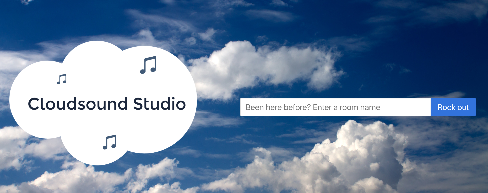
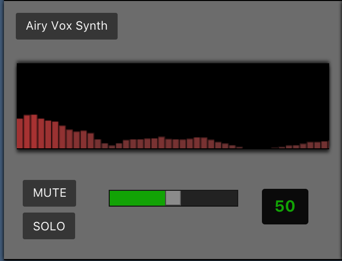
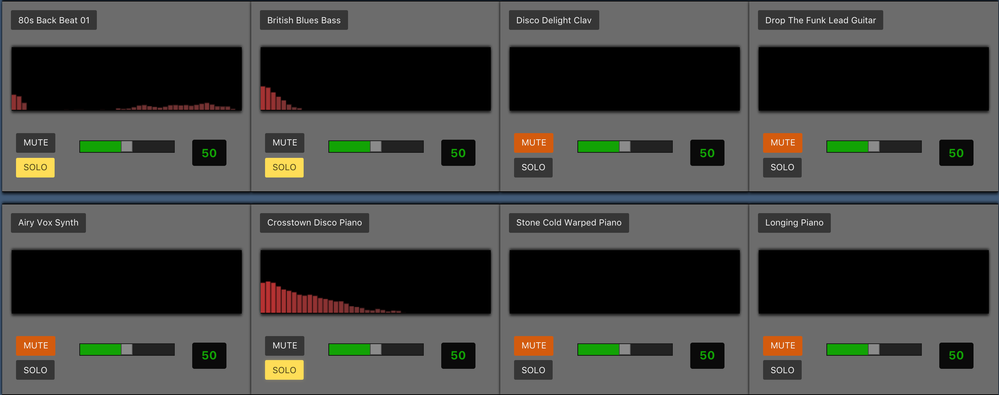
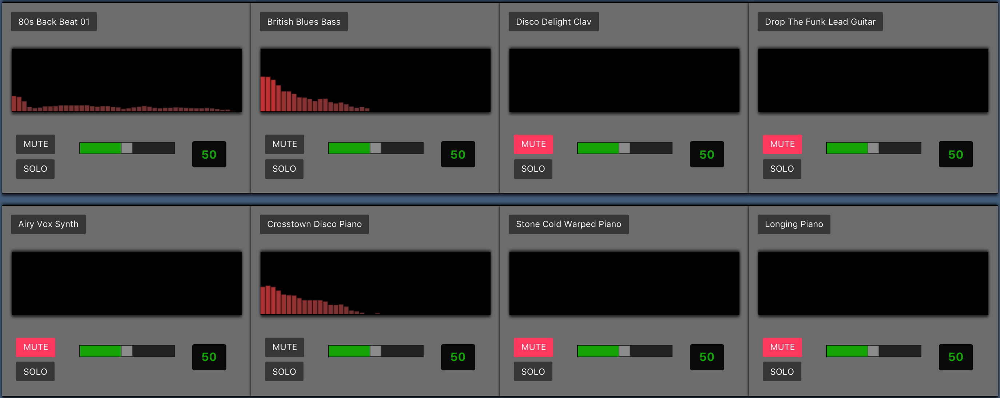

# Cloudsound Studio

A real-time, collaborative music making experience in the cloud. Users work together to interact with audio files via the Web Audio API to make their own mixes using a virtual studio.

# How to Use

### Creating and Sharing a new studio
Upon visiting the [home page](www.cloudsoundstudio.com) you will be greeted with a simple input field.



All you need to do to get started is enter a name and you will be sent to a studio of that name with a custom URL. To invite anyone else to come jam with you, just send them a link to your studio.

### Getting Started

As of now, entering a studio gives you the default selection of samples for eight tracks. It is important that all users refresh the page once someone new enters the studio, otherwise the state of the tracks may not sync up properly.



*An example of the track component with the default settings*

Each track includes a frequency-meter visualization that will activate once the track is playing, a mute button, a solo button, a volume slider and a button displaying the name of the currently selected sample.

All of these controls are attached to socket messages, and can therefore be controlled by any user who is in the studio. If one user clicks mute on a track, it will appear as active on all other users' screens that are in the studio and they will not hear the track play.

If a user adjusts the volume slider, it will have a red highlight on all other users' screens and will be disabled for all users except the one who is currently controlling the fader.  

### Playing/Stopping the Tracks

Playing and stopping the tracks are controlled by the Master Track.


*The master track controls*

Click the `PLAY ALL` button to play all tracks simultaneously. All of the tracks will loop indefinitely until you click `STOP ALL`, which will appear only when the tracks have started playing.

The `MASTER VOLUME` slider is the only control that does not have a web socket attached. This is a local volume control that allows you to control the overall volume of the mix without affecting the experience for anyone else connected.

### Muting and Soloing tracks

Although there is currently no way to play a track individually, each track can be independently muted and/or soloed. When a track is soloed, any track that is not also soloed will be temporarily muted, and the mute button will pulse orange to indicate this.


*An example of 3 tracks that are soloed*

Click the `CLEAR SOLO` button to un-solo all of the tracks simultaneously. Any tracks that are explicitly muted will remain muted.

Alternatively, instead of soloing the tracks that you want to hear you can mute the tracks that you don't want to hear. This example has the same three tracks playing as above, but using mutes instead of solos.



### Changing Samples

To change the track sample, click on the button and select the new sample from the dropdown menu. You can change samples while the track is playing, but you will need to start and stop the other tracks to be able to hear the new sample.


# How to Install

Fork and clone this repo, run `yarn install` to install the dependencies, then run `npm start` to spin up the server and allow you to use the app on a `localhost` port. To run a development server, run `npm run dev` and any changes you make to the server or client files will be automatically updated.

### Prerequisites

Cloudsound Studio currently streams the audio files from an Amazon S3 bucket.  To change the source of streaming audio you will need to edit the `baseUrl` within `public/app/studio/studio-service.js`. Also note that the current string manipulation code depends on the S3 bucket having a `:baseUrl/:category/:filename` format. For example: `s3-bucket-name/drums/bonham-drum-beat.mp3`.

### Deployment

This app is currently deployed on Heroku. To deploy, run:
```
$ git commit -m 'prep for deployment'
$ heroku create
$ git push heroku master
```

### Tech Stack

* [Web Audio API](https://developer.mozilla.org/en-US/docs/Web/API/Web_Audio_API) - All audio processing and visualizations
* [Socket.io](https://socket.io/) - For real-time communication
* [AngularJS v1.6](https://angularjs.org/) - Front end framework
* [Node.js/Express](https://expressjs.com/) - Lightweight server for handling web socket connections and future database functionality
* [Bulma.io](http://bulma.io/) - A modern CSS framework based on Flexbox
* [AWS S3](https://aws.amazon.com/s3/?nc2=h_l3_sc) - For hosting audio files


### Contributing

Fork and clone the [repo](https://github.com/mcdermz/cloudsound-studios) and make a pull request. That's it!


# Authors

* **[Sean McDermott](https://github.com/mcdermz)** - *Initial work and concept*


## Acknowledgments

* The developers at W3C who build and maintain the amazing Web Audio API
* Thanks to Wes, Derek, and all the other instructors at Galvanize Seattle
